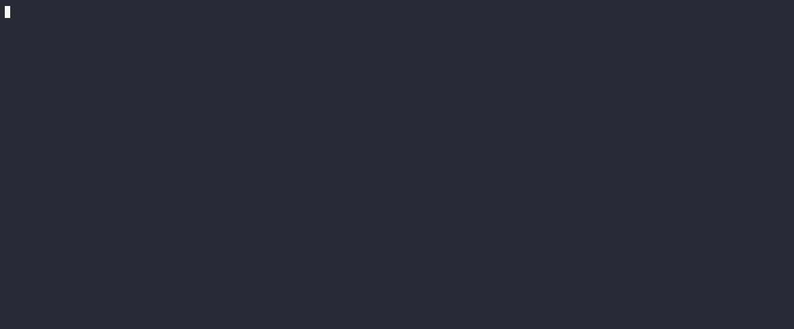

# CIAgent

**Your eval score is stable. Your system isn't.**

CIAgent tells you whether your agent's evals are lying to you:

- **Run the suite N times** — see which verdicts flip, with the blame attached
  (`agent-variance` → fix the agent, `judge-flake` → fix the eval)
- **Audit your LLM judge** against ground truth you already have
- **Replace judge calls with deterministic fact-checks** mined from your knowledge base



[](https://pypi.org/project/ciagent/)
[](https://github.com/suniel12/ciagent/actions/workflows/ci.yml)
[](LICENSE)
[](AGENTS.md)

Built from a real study: 1 in 7 answers an LLM judge passed were wrong, and deterministic
checks caught 8 of 8 — methodology and raw numbers in [STUDY.md](STUDY.md).
Native adapters for OpenAI, Anthropic, and LangGraph; imports exported traces
from any stack — OpenTelemetry (openllmetry, Google ADK), Langfuse, and
LangSmith — verified against real captures from OpenAI, Anthropic, CrewAI,
Google ADK, and the Claude Agent SDK. Runs inside pytest.

## See It in 30 Seconds

No install, no API keys, no config — one command runs a bundled demo suite three times on synthetic traces:

```bash
uvx ciagent test --mock --runs 3
```

```
Run 1/3: 7/8 passed
Run 2/3: 7/8 passed
Run 3/3: 7/8 passed

────────────────────────────────────────────────────────────
Stability Report
────────────────────────────────────────────────────────────
Suite score across 3 runs: 88%  /  88%  /  88%     ← looks stable

⚠️  FLAKY — 3/8 queries flipped verdicts across runs:      ← is not
   "What's your return window?"    ❌✅✅  pass_rate=0.67  source: agent-variance
   "Do you ship internationally?"  ✅❌✅  pass_rate=0.67  source: agent-variance
   "How do I reset my password?"   ✅✅❌  pass_rate=0.67  source: agent-variance

   Flip sources: 3 agent-variance (fix the agent) │ 0 judge-flake (fix the eval)
```

The aggregate score is identical every run. Three of the eight verdicts underneath it flipped. A single-run eval score would never tell you — the stability report does, and attributes every flip to the layer that caused it. (The demo simulates a flaky agent; point it at your own with the spec below.)

## A stable score is not a stable system

Run the identical eval three times and you can get 96% / 95% / 96% — rock solid — while
individual queries flip verdicts every run. The aggregate holds because the errors move
around. `--runs N` shows what a single run can't:

```bash
ciagent test --runs 3
```

```
Run 1/3: 18/19 passed
Run 2/3: 18/19 passed
Run 3/3: 18/19 passed

────────────────────────────────────────────────────────────
Stability Report
────────────────────────────────────────────────────────────
Suite score across 3 runs: 95%  /  95%  /  95%

⚠️  FLAKY — 2/19 queries flipped verdicts across runs:
   "What's your return window?"    ✅❌✅  pass_rate=0.67  source: agent-variance (answer changed)
   "Do you sell gift cards?"       ❌✅✅  pass_rate=0.67  source: judge-flake (same answer, verdict flipped)

   Flip sources: 1 agent-variance (fix the agent) │ 1 judge-flake (fix the eval) │ 0 infra-error (retry) │ 0 mixed

Stability verdict: FLAKY
```

Every flip is attributed to its source, so it's a routed work item, not a scary number:
**agent-variance** means the agent produced different output (fix the prompt, retrieval, or
temperature); **judge-flake** means the output — or every deterministic check's outcome —
was identical but the LLM judge changed its mind (fix the rubric, or replace the judge with
a deterministic check); **infra-error** means a judge API call failed (retry, fix nothing).
Attribution is structural, not guessed: deterministic checks cannot flip on identical
output, and per-layer sub-verdicts are compared across runs. The console shows observed
facts; pass@k/pass^k estimates live in the JSON output, labeled as estimates.

Flaky-but-passing exits 0 so adoption won't break your CI; add `--fail-on-flaky` when
you're ready to gate on it. Try it with zero API keys:
`AGENTCI_MOCK_FLAKY=1 ciagent test --mock --runs 3`. Details: [docs/stability.md](docs/stability.md).

## Audit the judge itself

An LLM judge that shares your agent's context inherits your agent's blind spots: when
retrieval comes up empty, the agent answers from nothing — and the judge, reading the same
nothing, passes it. `judge-audit` measures your judge against ground truth you already have,
by re-scoring recorded baselines (the agent is never re-run):

```bash
ciagent judge-audit
```

1. **Judge vs. deterministic checks** — the disagreement matrix. The row that matters:
   answers the judge PASSED that a hard fact-check FAILED.
2. **Retest stability** — the same answer judged `--repeats` times; flips on identical
   input are the judge's own noise floor.
3. **Hand labels** (`--labels`) — agreement + Cohen's κ against your own review.

The claim is deliberately one-directional: a judge that fails where you *can* check it
shouldn't be trusted where you can't. Verdict: `TRUSTWORTHY` / `NEEDS CALIBRATION` /
`UNRELIABLE`. Details: [docs/judge-audit.md](docs/judge-audit.md).

## Check facts in code. Save the judge for judgment.

Most agent failures that matter involve a hard fact — a product name, a price, a version number. Those are checkable deterministically, for free. And an LLM judge grading against the same context as your agent inherits your agent's blind spots: when retrieval comes up empty, the agent answers from nothing and the judge — reading the same nothing — passes it.

So CIAgent runs deterministic checks first and treats the judge as the last resort, not the default:

1. **Fact checks in code** — `expected_in_answer`, `not_in_answer`, `regex_match`, `json_schema`. Zero LLM calls, zero flakiness, same verdict every run.
2. **Path checks** — did the agent call the tools it should have? A missing expected tool warns; a forbidden tool fails.
3. **Cost budgets** — LLM calls, tokens, dollars per query.
4. **LLM judge** (`llm_judge` rubrics, optional) — only for answers that genuinely need judgment, evaluated after every deterministic check has run.

Don't write the fact checks by hand — mine them from your knowledge base:

```bash
ciagent generate-checks
```

It extracts hard facts (prices, rates, SKUs, "30 days") as variant-set assertions, and
**validates every candidate against your recorded golden answers first** — a check that
would fail a known-good answer is rejected before you ever see it. One LLM call at
authoring time; the checks run free forever. Details: [docs/generate-checks.md](docs/generate-checks.md).

## Add to Your Project

```bash
pip install ciagent
```

Write your golden queries — what should your agent handle, and what should it refuse?

```yaml
# agentci_spec.yaml
agent: my-agent
# runner: any function that takes a query string and returns a response
runner: my_app.agent:run_for_agentci
queries:
  - query: "How do I install CIAgent?"
    correctness:
      any_expected_in_answer: ["pip install", "ciagent"]
    path:
      expected_tools: [retrieve_docs]
    retrieval:
      tool: retrieve_docs      # assert on what the retriever actually returned
      forbid_empty: true       # empty retrieval + confident answer = ungrounded
      expected_sources: [install.md]
    cost:
      max_llm_calls: 8

  - query: "What's the CEO's favorite restaurant?"
    correctness:
      not_in_answer: ["restaurant", "favorite"]
    path:
      expected_tools: []  # expect no tools called for out-of-scope queries
```

Run:

```bash
ciagent test --mock       # start here: zero-cost with synthetic traces
ciagent test              # run live against your real agent
```

`ciagent test` evaluates each query through 4 layers — correctness, path, retrieval, and cost. The retrieval layer reads the retriever tool's captured result and warns on empty retrievals, missing sources, and count floors — deterministically, and it SKIPs (never guesses) when a result wasn't captured or doesn't parse:

```
============================================================

Query: How do I install CIAgent?
Answer: To install CIAgent, you can use pip with the following command:
        pip install ciagent. Make sure you have Python 3.10 or later.

  ✅  CORRECTNESS: PASS
       ✓ Found keywords: "pip install ciagent"
       ✓ LLM judge passed (score: 5 ≥ 0.6)
  📈  PATH: PASS
       ✓ Tool recall: 1.000 (expected: [retrieve_docs])
       ✓ Tool precision: 0.500
       ✓ No loops detected
  💰  COST: PASS
       ✓ LLM calls: 8 ≤ max 8

============================================================

Query: What Python version does CIAgent require and what frameworks does it support?
Answer: CIAgent currently does not specify a required Python version
        in the provided context, so I don't have that information...

  ❌  CORRECTNESS: FAIL
       • Expected '3.10' not found in answer
  📈  PATH: PASS
       ✓ Tool recall: 1.000 (expected: [retrieve_docs])
       ✓ Loops: 1 ≤ max 3
  💰  COST: PASS
       ✓ LLM calls: 4 ≤ max 5

============================================================
```

Don't have golden queries yet? `ciagent init --generate` scans your code and generates a starter spec.

## Let your coding agent set it up

CIAgent ships as a Claude Code plugin. Two skills: **onboard** (writes the runner,
records golden baselines, generates the spec, verifies it) and **check** (runs the
right test after every change to your agent and routes failures by flip source).

```
/plugin marketplace add suniel12/ciagent
/plugin install ciagent@ciagent
```

Then ask your coding agent to "set up CIAgent for this repo." It records goldens with
`ciagent bootstrap --yes` and verifies with `ciagent test --runs 3` — no human CLI use
needed. The runner it writes is one function: `(query: str) -> str`; trace capture is
automatic.

## Demo

Here's a RAG agent demo where someone "optimizes for latency" by reducing retriever docs from 8 to 1. CIAgent catches the correctness regression:


## CLI

```bash
ciagent init --generate        # Scan project, generate test spec
ciagent init                   # Generate GitHub Actions workflow + pre-push hook
ciagent test --mock --yes      # Zero-cost synthetic traces, CI-friendly (no keys, no prompts)
ciagent test                   # Run 3-layer evaluation (correctness → path → cost)
ciagent test --runs 3          # Stability report: verdict flips + flip-source attribution
ciagent judge-audit            # Audit the LLM judge against checks, retests, hand labels
ciagent generate-checks        # Mine KB facts into deterministic assertions (gated)
ciagent test --format html -o report.html  # HTML report with per-query details
ciagent calibrate              # Measure real agent metrics, auto-tune spec budgets
ciagent doctor                 # Health check: spec, deps, API keys
ciagent record <test>          # Record golden baseline
ciagent diff                   # Diff against baseline
ciagent report -i results.json # Generate HTML report from JSON results
ciagent simulate --stage       # Auto-stage failing conversations (repro never lost)
ciagent stage list             # Triage staged failures, best-to-promote first
ciagent promote <id>           # One staged failure becomes a golden CI gate
ciagent world freeze <id>      # Freeze the failing run's tool traffic
ciagent simulate --replay ./golden --world worlds/x.world.json  # Frozen-backend replay
ciagent mcp --project .        # MCP server: coding agents run this loop themselves
```
## Docs

- [Quickstart](docs/quickstart.md) — install to first green run
- [Simulate](docs/simulate.md) — multi-turn conversation scenarios: scripted for CI, generative personas as the finder
- [Stability testing](docs/stability.md) — `--runs N`, flip-source attribution
- [Judge audit](docs/judge-audit.md) — is your LLM judge lying to you?
- [Generate checks](docs/generate-checks.md) — mine KB facts into gated assertions
- [Writing tests](docs/writing-tests.md) — the full spec reference
- [Cost tracking](docs/cost-tracking.md) — budgets and spike detection
- [Golden traces](docs/golden-traces.md) — record baselines, diff regressions
- [Import production traces](docs/import.md) — turn an exported OTel (openllmetry/ADK), Langfuse, or LangSmith trace into a gated regression test
- [Golden promotion](docs/promotion.md) — auto-stage failing simulate conversations, triage, one-command promote
- [Simulated world](docs/world.md) — freeze a failing run's tool traffic, replay against it deterministically
- [MCP server](docs/mcp.md) — the whole loop, operable by coding agents (Claude Code, Cursor)
- [World-file format](docs/world-file-schema.md) — the frozen-tool-state format, published with a JSON Schema
- [Failure Atlas](src/ciagent/examples/failure-atlas/) — runnable, OWASP-mapped agent failure patterns
- [CI/CD integration](docs/ci-cd.md) — GitHub Actions setup
- [LangGraph](docs/langgraph.md) — graph-based agent support
- [Metrics reference](docs/metrics_reference.md) — every metric, defined

## Why not just an LLM judge?

Judge-only evals are expensive, flaky, and blind to their own context. CIAgent is pytest-native regression testing: deterministic checks catch the factual failures, golden traces catch behavioral drift, cost budgets catch spend regressions — and the judge handles only what genuinely needs judgment. Mock mode (`ciagent test --mock`) runs the whole suite with zero API keys and zero cost, so it can gate every PR.

## Contributing

[GitHub Issues](https://github.com/suniel12/ciagent/issues) ·
[DemoAgents](https://github.com/suniel12/DemoAgents) — working examples for OpenAI, Anthropic, and LangGraph agents

Apache 2.0. If you build an agent and test it with CIAgent, I'd love to hear about it.

---
